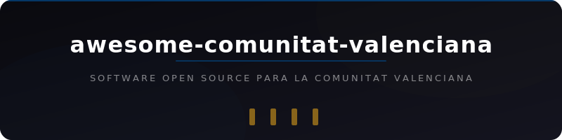

<div align="center">
  
  <br><br>
  <a href="https://awesome.re"></a>
  <br><br>
  <p>Una selección de software open source que da soporte específico a la Comunitat Valenciana, sus municipios, universidades e instituciones.</p>
</div>

## Contenido

<!--lint disable awesome-list-item-->

- [Administración y Gobierno Autonómico](#administración-y-gobierno-autonómico)
- [Comunidad Tecnológica](#comunidad-tecnológica)
- [Cultura y Patrimonio](#cultura-y-patrimonio)
- [Datos Abiertos y Cartografía](#datos-abiertos-y-cartografía)
- [Educación y LliureX](#educación-y-lliurex)
- [Lengua Valenciana](#lengua-valenciana)
- [Transporte y Movilidad](#transporte-y-movilidad)
- [Universidad](#universidad)

<!--lint enable awesome-list-item-->

**Leyenda:** Cada entrada muestra:  estrellas,  actividad,  lenguaje,  licencia, [](https://www.gva.es/) etiqueta de institución/ubicación, ([Demo](https://github.com/GeiserX/awesome-comunitat-valenciana)) demo en vivo. Todas las insignias son clicables y se actualizan automáticamente. Las etiquetas enlazan a las páginas oficiales de cada institución.

## Administración y Gobierno Autonómico

- [Consul GVA](https://github.com/Usabi/consul_gva) [](https://github.com/Usabi/consul_gva/stargazers) [](https://github.com/Usabi/consul_gva/commits/main) [](https://github.com/Usabi/consul_gva) [](https://github.com/Usabi/consul_gva/blob/main/LICENSE) [](https://www.gva.es/) - Plataforma de participación ciudadana Consul adaptada para la Generalitat Valenciana.
- [IDEV Visor](https://github.com/AlfonsoMoyaFuero/idev_visor) [](https://github.com/AlfonsoMoyaFuero/idev_visor/stargazers) [](https://github.com/AlfonsoMoyaFuero/idev_visor/commits/master) [](https://github.com/AlfonsoMoyaFuero/idev_visor) [](https://github.com/AlfonsoMoyaFuero/idev_visor/blob/master/LICENSE) [](https://www.gva.es/) [](https://idev.gva.es/) - Visor de la Infraestructura Valenciana de Datos Espaciales (IDEV) de la Generalitat Valenciana.
- [Legislación Conservatorios GVA](https://github.com/JLMirallesB/legis_cpmdem) [](https://github.com/JLMirallesB/legis_cpmdem/stargazers) [](https://github.com/JLMirallesB/legis_cpmdem/commits/main) [](https://github.com/JLMirallesB/legis_cpmdem) [](https://github.com/JLMirallesB/legis_cpmdem/blob/main/LICENSE) [](https://www.gva.es/) - Lector de legislación de Conservatorios Profesionales de Música de la Generalitat Valenciana.
- [OposGV](https://github.com/girdeux31/oposGV) [](https://github.com/girdeux31/oposGV/stargazers) [](https://github.com/girdeux31/oposGV/commits/main) [](https://github.com/girdeux31/oposGV) [](https://github.com/girdeux31/oposGV/blob/main/LICENSE) [](https://www.gva.es/) - Herramienta para obtener estadísticas de oposiciones de profesorado de secundaria en la Generalitat Valenciana.
- [Registro Civil GVA](https://github.com/vk496/registro-civil-spa-gva) [](https://github.com/vk496/registro-civil-spa-gva/stargazers) [](https://github.com/vk496/registro-civil-spa-gva/commits/main) [](https://github.com/vk496/registro-civil-spa-gva) [](https://github.com/vk496/registro-civil-spa-gva/blob/main/LICENSE) [](https://www.gva.es/) - Herramienta para automatizar la obtención de cita previa en el Registro Civil de la Generalitat Valenciana.

## Comunidad Tecnológica

- [Alicante Frontend](https://github.com/AlicanteFrontend/alicantefrontend.github.io) [](https://github.com/AlicanteFrontend/alicantefrontend.github.io/stargazers) [](https://github.com/AlicanteFrontend/alicantefrontend.github.io/commits/master) [](https://github.com/AlicanteFrontend/alicantefrontend.github.io) [](https://github.com/AlicanteFrontend/alicantefrontend.github.io/blob/master/LICENSE) [](https://www.alicante.es/) - Sitio web de la comunidad Alicante Frontend, grupo de meetups sobre desarrollo web en Alicante.
- [Alicante Frontend Talks](https://github.com/AlicanteFrontend/talks) [](https://github.com/AlicanteFrontend/talks/stargazers) [](https://github.com/AlicanteFrontend/talks/commits/master) [](https://github.com/AlicanteFrontend/talks) [](https://github.com/AlicanteFrontend/talks/blob/master/LICENSE) [](https://www.alicante.es/) - Materiales y presentaciones de las meetups de Alicante Frontend.
- [Awesome Alicante Remote Work](https://github.com/AlicanteFrontend/awesome-alicante-remote-work) [](https://github.com/AlicanteFrontend/awesome-alicante-remote-work/stargazers) [](https://github.com/AlicanteFrontend/awesome-alicante-remote-work/commits/master) [](https://github.com/AlicanteFrontend/awesome-alicante-remote-work) [](https://github.com/AlicanteFrontend/awesome-alicante-remote-work/blob/master/LICENSE) [](https://www.alicante.es/) - Lista de lugares en Alicante para trabajar en remoto.
- [VLCTechFest](https://github.com/VLCTechHub/VLCTechFest2026) [](https://github.com/VLCTechHub/VLCTechFest2026/stargazers) [](https://github.com/VLCTechHub/VLCTechFest2026/commits/main) [](https://github.com/VLCTechHub/VLCTechFest2026) [](https://github.com/VLCTechHub/VLCTechFest2026/blob/main/LICENSE) [](https://www.valencia.es/) - Sitio web del VLCTechFest, la conferencia tecnológica anual de la comunidad VLCTechHub en Valencia.
- [VLCTechHub API](https://github.com/VLCTechHub/VLCTechHub-api) [](https://github.com/VLCTechHub/VLCTechHub-api/stargazers) [](https://github.com/VLCTechHub/VLCTechHub-api/commits/main) [](https://github.com/VLCTechHub/VLCTechHub-api) [](https://github.com/VLCTechHub/VLCTechHub-api/blob/main/LICENSE) [](https://www.valencia.es/) - API REST de la comunidad tecnológica de Valencia.
- [VLCTechHub Push](https://github.com/VLCTechHub/VLCTechHub-push) [](https://github.com/VLCTechHub/VLCTechHub-push/stargazers) [](https://github.com/VLCTechHub/VLCTechHub-push/commits/master) [](https://github.com/VLCTechHub/VLCTechHub-push) [](https://github.com/VLCTechHub/VLCTechHub-push/blob/master/LICENSE) [](https://www.valencia.es/) - Servidor de notificaciones push para la aplicación de VLCTechHub.
- [VLCTechHub Site](https://github.com/VLCTechHub/VLCTechHub-site) [](https://github.com/VLCTechHub/VLCTechHub-site/stargazers) [](https://github.com/VLCTechHub/VLCTechHub-site/commits/main) [](https://github.com/VLCTechHub/VLCTechHub-site) [](https://github.com/VLCTechHub/VLCTechHub-site/blob/main/LICENSE) [](https://www.valencia.es/) ([Demo](https://vlctechhub.org)) - Sitio web de VLCTechHub, la comunidad tecnológica de Valencia con eventos, meetups y ofertas de empleo.
- [Vue Day Alicante](https://github.com/AlicanteFrontend/vueday.org) [](https://github.com/AlicanteFrontend/vueday.org/stargazers) [](https://github.com/AlicanteFrontend/vueday.org/commits/master) [](https://github.com/AlicanteFrontend/vueday.org) [](https://github.com/AlicanteFrontend/vueday.org/blob/master/LICENSE) [](https://www.alicante.es/) - Sitio web del Vue Day, conferencia de un día sobre Vue.js en Alicante organizada por Alicante Frontend.

## Cultura y Patrimonio

- [BIC Inmateriales Valencianos](https://github.com/LGarsando/BIC-inmateriales-valencianos) [](https://github.com/LGarsando/BIC-inmateriales-valencianos/stargazers) [](https://github.com/LGarsando/BIC-inmateriales-valencianos/commits/main) [](https://github.com/LGarsando/BIC-inmateriales-valencianos) [](https://github.com/LGarsando/BIC-inmateriales-valencianos/blob/main/LICENSE) [](https://www.gva.es/) - Visualización de los Bienes de Interés Cultural inmateriales de la Comunitat Valenciana.
- [Jocs Literatura Valenciana](https://github.com/abdelachbani/Jocs-Literatura-Valenciana) [](https://github.com/abdelachbani/Jocs-Literatura-Valenciana/stargazers) [](https://github.com/abdelachbani/Jocs-Literatura-Valenciana/commits/master) [](https://github.com/abdelachbani/Jocs-Literatura-Valenciana) [](https://github.com/abdelachbani/Jocs-Literatura-Valenciana/blob/master/LICENSE) [](https://www.valencia.es/) - Aplicación de escritorio con juegos e información sobre literatura valenciana.

## Datos Abiertos y Cartografía

- [Calidad de Aire CV](https://github.com/jfcaro/Calidad-de-Aire---Comunidad-Valenciana) [](https://github.com/jfcaro/Calidad-de-Aire---Comunidad-Valenciana/stargazers) [](https://github.com/jfcaro/Calidad-de-Aire---Comunidad-Valenciana/commits/master) [](https://github.com/jfcaro/Calidad-de-Aire---Comunidad-Valenciana) [](https://github.com/jfcaro/Calidad-de-Aire---Comunidad-Valenciana/blob/master/LICENSE) [](https://www.gva.es/) - Análisis de datos de calidad del aire en la Comunidad Valenciana.
- [Notas PAU CV](https://github.com/JavierRibaldelRio/Notas-PAU-CV) [](https://github.com/JavierRibaldelRio/Notas-PAU-CV/stargazers) [](https://github.com/JavierRibaldelRio/Notas-PAU-CV/commits/main) [](https://github.com/JavierRibaldelRio/Notas-PAU-CV) [](https://github.com/JavierRibaldelRio/Notas-PAU-CV/blob/main/LICENSE) [](https://www.gva.es/) - Estadísticas y análisis de la evolución de las notas de corte de la PAU en la Comunidad Valenciana.
- [Població Valenciana](https://github.com/miquelmatoses/poblacio-valenciana) [](https://github.com/miquelmatoses/poblacio-valenciana/stargazers) [](https://github.com/miquelmatoses/poblacio-valenciana/commits/main) [](https://github.com/miquelmatoses/poblacio-valenciana) [](https://github.com/miquelmatoses/poblacio-valenciana/blob/main/LICENSE) [](https://www.gva.es/) - Evolución de la población valenciana por municipio en los siglos XX y XXI.

## Educación y LliureX

- [AraSuite](https://github.com/lliurex/arasuite) [](https://github.com/lliurex/arasuite/stargazers) [](https://github.com/lliurex/arasuite/commits/main) [](https://github.com/lliurex/arasuite) [](https://github.com/lliurex/arasuite/blob/main/LICENSE) [](https://portal.edu.gva.es/lliurex/) [](https://www.gva.es/) - Conjunto de herramientas de comunicación aumentativa y adaptativa para LliureX.
- [Aules GVA Ctrl+Enter](https://github.com/rvf1-k/Enviar-con-Ctrl-Enter-en-Aules-GVA) [](https://github.com/rvf1-k/Enviar-con-Ctrl-Enter-en-Aules-GVA/stargazers) [](https://github.com/rvf1-k/Enviar-con-Ctrl-Enter-en-Aules-GVA/commits/main) [](https://github.com/rvf1-k/Enviar-con-Ctrl-Enter-en-Aules-GVA) [](https://github.com/rvf1-k/Enviar-con-Ctrl-Enter-en-Aules-GVA/blob/main/LICENSE) [](https://www.gva.es/) [](https://portal.edu.gva.es/aules/) - Script Tampermonkey para enviar tareas con Ctrl+Enter en la plataforma educativa Aules de la Generalitat Valenciana.
- [Awesome Comunitat LliureX](https://github.com/comunitatlliurex/awesome) [](https://github.com/comunitatlliurex/awesome/stargazers) [](https://github.com/comunitatlliurex/awesome/commits/main) [](https://github.com/comunitatlliurex/awesome) [](https://github.com/comunitatlliurex/awesome/blob/main/LICENSE) [](https://portal.edu.gva.es/lliurex/) [](https://www.gva.es/) - Lista de recursos y proyectos de la comunidad LliureX.
- [Bell Scheduler](https://github.com/lliurex/bell-scheduler) [](https://github.com/lliurex/bell-scheduler/stargazers) [](https://github.com/lliurex/bell-scheduler/commits/main) [](https://github.com/lliurex/bell-scheduler) [](https://github.com/lliurex/bell-scheduler/blob/main/LICENSE) [](https://portal.edu.gva.es/lliurex/) [](https://www.gva.es/) - Interfaz gráfica para programar alarmas y timbres en centros educativos LliureX.
- [Dpkg Unlocker](https://github.com/lliurex/dpkg-unlocker) [](https://github.com/lliurex/dpkg-unlocker/stargazers) [](https://github.com/lliurex/dpkg-unlocker/commits/main) [](https://github.com/lliurex/dpkg-unlocker) [](https://github.com/lliurex/dpkg-unlocker/blob/main/LICENSE) [](https://portal.edu.gva.es/lliurex/) [](https://www.gva.es/) - Herramienta para desbloquear Apt, Dpkg y LliureX-Up en sistemas LliureX.
- [Epoptes LliureX](https://github.com/lliurex/epoptes) [](https://github.com/lliurex/epoptes/stargazers) [](https://github.com/lliurex/epoptes/commits/master) [](https://github.com/lliurex/epoptes) [](https://github.com/lliurex/epoptes/blob/master/LICENSE) [](https://portal.edu.gva.es/lliurex/) [](https://www.gva.es/) - Herramienta de monitorización de aulas informáticas, versión adaptada para LliureX.
- [LliureX OneDrive](https://github.com/lliurex/lliurex-onedrive) [](https://github.com/lliurex/lliurex-onedrive/stargazers) [](https://github.com/lliurex/lliurex-onedrive/commits/main) [](https://github.com/lliurex/lliurex-onedrive) [](https://github.com/lliurex/lliurex-onedrive/blob/main/LICENSE) [](https://portal.edu.gva.es/lliurex/) [](https://www.gva.es/) - Interfaz gráfica para OneDrive en LliureX.
- [LliureX Rebost](https://github.com/lliurex/rebost) [](https://github.com/lliurex/rebost/stargazers) [](https://github.com/lliurex/rebost/commits/main) [](https://github.com/lliurex/rebost) [](https://github.com/lliurex/rebost/blob/main/LICENSE) [](https://portal.edu.gva.es/lliurex/) [](https://www.gva.es/) - Motor de gestión de software distro-agnóstico desarrollado por LliureX.
- [LliureX Store](https://github.com/lliurex/lliurex-store) [](https://github.com/lliurex/lliurex-store/stargazers) [](https://github.com/lliurex/lliurex-store/commits/main) [](https://github.com/lliurex/lliurex-store) [](https://github.com/lliurex/lliurex-store/blob/main/LICENSE) [](https://portal.edu.gva.es/lliurex/) [](https://www.gva.es/) - Tienda de aplicaciones de LliureX compatible con repositorios, zomandos, Snap y AppImage.
- [LliureX Store (Frontend)](https://github.com/lliurex/store) [](https://github.com/lliurex/store/stargazers) [](https://github.com/lliurex/store/commits/main) [](https://github.com/lliurex/store) [](https://github.com/lliurex/store/blob/main/LICENSE) [](https://portal.edu.gva.es/lliurex/) [](https://www.gva.es/) - Interfaz gráfica para la tienda de aplicaciones de LliureX.
- [LliureX Zero Server Wizard](https://github.com/lliurex/zero-server-wizard) [](https://github.com/lliurex/zero-server-wizard/stargazers) [](https://github.com/lliurex/zero-server-wizard/commits/main) [](https://github.com/lliurex/zero-server-wizard) [](https://github.com/lliurex/zero-server-wizard/blob/main/LICENSE) [](https://portal.edu.gva.es/lliurex/) [](https://www.gva.es/) - Asistente de configuración de servidores para centros educativos LliureX.
- [LTSP LliureX](https://github.com/lliurex/ltsp) [](https://github.com/lliurex/ltsp/stargazers) [](https://github.com/lliurex/ltsp/commits/master) [](https://github.com/lliurex/ltsp) [](https://github.com/lliurex/ltsp/blob/master/LICENSE) [](https://portal.edu.gva.es/lliurex/) [](https://www.gva.es/) - Soporte LTSP (Linux Terminal Server Project) adaptado para clientes ligeros en centros educativos LliureX.
- [NoteShrink GUI](https://github.com/lliurex/noteshrink-gui) [](https://github.com/lliurex/noteshrink-gui/stargazers) [](https://github.com/lliurex/noteshrink-gui/commits/main) [](https://github.com/lliurex/noteshrink-gui) [](https://github.com/lliurex/noteshrink-gui/blob/main/LICENSE) [](https://portal.edu.gva.es/lliurex/) [](https://www.gva.es/) - Interfaz gráfica para convertir escaneos de notas manuscritas a PDF compactos en LliureX.
- [Task Scheduler](https://github.com/lliurex/taskscheduler) [](https://github.com/lliurex/taskscheduler/stargazers) [](https://github.com/lliurex/taskscheduler/commits/main) [](https://github.com/lliurex/taskscheduler) [](https://github.com/lliurex/taskscheduler/blob/main/LICENSE) [](https://portal.edu.gva.es/lliurex/) [](https://www.gva.es/) - Programador de tareas preconfiguradas para sistemas LliureX.

## Lengua Valenciana

- [Softvalencià](https://github.com/Softcatala/wp-softvalencia) [](https://github.com/Softcatala/wp-softvalencia/stargazers) [](https://github.com/Softcatala/wp-softvalencia/commits/master) [](https://github.com/Softcatala/wp-softvalencia) [](https://github.com/Softcatala/wp-softvalencia/blob/master/LICENSE) [](https://www.softvalencia.org/) - Tema WordPress del portal Softvalencià, plataforma de promoción del software en valenciano.

## Transporte y Movilidad

- [Alicante-Murcia SUMO Scenario](https://github.com/jjgonde/Alicante-Murcia-SUMO-Scenario) [](https://github.com/jjgonde/Alicante-Murcia-SUMO-Scenario/stargazers) [](https://github.com/jjgonde/Alicante-Murcia-SUMO-Scenario/commits/master) [](https://github.com/jjgonde/Alicante-Murcia-SUMO-Scenario) [](https://github.com/jjgonde/Alicante-Murcia-SUMO-Scenario/blob/master/LICENSE) [](https://www.alicante.es/) [](https://eclipse.dev/sumo/) - Escenario calibrado de simulación de tráfico SUMO para la autovía A-7 entre Alicante y Murcia.
- [EMTValencia-API](https://github.com/ElEd0/EMTValencia-API) [](https://github.com/ElEd0/EMTValencia-API/stargazers) [](https://github.com/ElEd0/EMTValencia-API/commits/main) [](https://github.com/ElEd0/EMTValencia-API) [](https://github.com/ElEd0/EMTValencia-API/blob/main/LICENSE) [](https://www.emtvalencia.es/) [](https://www.valencia.es/) - Módulo Python para consultar horarios y paradas de autobuses de la EMT de Valencia.
- [MetroValencia](https://github.com/luisnomad/metrovalencia) [](https://github.com/luisnomad/metrovalencia/stargazers) [](https://github.com/luisnomad/metrovalencia/commits/main) [](https://github.com/luisnomad/metrovalencia) [](https://github.com/luisnomad/metrovalencia/blob/main/LICENSE) [](https://www.fgv.es/) [](https://www.valencia.es/) - Herramienta para consultar horarios y líneas de MetroValencia (Ferrocarrils de la Generalitat Valenciana).
- [pyemtvlc](https://github.com/andoniaf/pyemtvlc) [](https://github.com/andoniaf/pyemtvlc/stargazers) [](https://github.com/andoniaf/pyemtvlc/commits/main) [](https://github.com/andoniaf/pyemtvlc) [](https://github.com/andoniaf/pyemtvlc/blob/main/LICENSE) [](https://www.emtvalencia.es/) [](https://www.valencia.es/) - Paquete Python para consultar horarios y paradas de la EMT de Valencia.
- [ValenBisi](https://github.com/systemallica/ValenBisi) [](https://github.com/systemallica/ValenBisi/stargazers) [](https://github.com/systemallica/ValenBisi/commits/main) [](https://github.com/systemallica/ValenBisi) [](https://github.com/systemallica/ValenBisi/blob/main/LICENSE) [](https://www.valenbisi.es/) [](https://www.valencia.es/) - Aplicación Android para consultar estaciones y disponibilidad de ValenBisi, el servicio de bicicleta compartida de Valencia.
- [ValenBisi BOT](https://github.com/dansmachina/valenbisiBOT) [](https://github.com/dansmachina/valenbisiBOT/stargazers) [](https://github.com/dansmachina/valenbisiBOT/commits/master) [](https://github.com/dansmachina/valenbisiBOT) [](https://github.com/dansmachina/valenbisiBOT/blob/master/LICENSE) [](https://www.valenbisi.es/) [](https://www.valencia.es/) - Bot de Telegram para consultar disponibilidad del servicio de bicicleta compartida ValenBisi de Valencia.
- [ZeppOS-EMT](https://github.com/Humanoidear/ZeppOS-EMT) [](https://github.com/Humanoidear/ZeppOS-EMT/stargazers) [](https://github.com/Humanoidear/ZeppOS-EMT/commits/main) [](https://github.com/Humanoidear/ZeppOS-EMT) [](https://github.com/Humanoidear/ZeppOS-EMT/blob/main/LICENSE) [](https://www.emtvalencia.es/) [](https://www.valencia.es/) - Aplicación para consultar horarios de la EMT de Valencia en dispositivos ZeppOS (relojes inteligentes).

## Universidad

- [TFG-TFM EPS UA](https://github.com/jmrplens/TFG-TFM_EPS) [](https://github.com/jmrplens/TFG-TFM_EPS/stargazers) [](https://github.com/jmrplens/TFG-TFM_EPS/commits/main) [](https://github.com/jmrplens/TFG-TFM_EPS) [](https://github.com/jmrplens/TFG-TFM_EPS/blob/main/LICENSE) [](https://www.ua.es/) - Plantilla LaTeX para la elaboración de TFG y TFM en la Escuela Politécnica Superior de la Universitat d'Alacant.

## Insignia

Si tu proyecto aparece en esta lista, puedes añadir una de estas insignias a tu README para que la gente lo sepa.

<!--lint disable double-link-->

   

Flat (por defecto):
```markdown
[](https://github.com/GeiserX/awesome-comunitat-valenciana#readme)
```

Flat square:
```markdown
[](https://github.com/GeiserX/awesome-comunitat-valenciana#readme)
```

Plastic:
```markdown
[](https://github.com/GeiserX/awesome-comunitat-valenciana#readme)
```

For the badge (grande):
```markdown
[](https://github.com/GeiserX/awesome-comunitat-valenciana#readme)
```

## Contribuir

Las contribuciones bienvenidas. Lee las [directrices de contribución](contributing.md) antes de enviar un pull request.

## Nota

Esta lista se centra en software open source que da **soporte específico a la Comunitat Valenciana** o que incluye funcionalidades relevantes para usuarios en esta comunidad autónoma. No se incluye software genérico solo por estar creado por desarrolladores valencianos.

## Descargo de responsabilidad

No se aceptan proyectos relacionados con pornografía, contenido NSFW, loterías o apuestas, religión, política partidista ni cualquier otro tema controvertido. Esta lista pretende ser un recurso técnico neutral y útil para la comunidad de desarrolladores.
